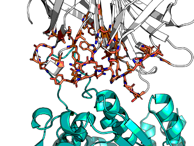
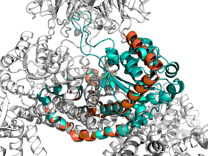

# crysalin

The aim is to engineer a better crysalin lattice.

## Background

Crysalins are an engineered complex that forms a lattice for encapsulating protein for X-ray crystallography.
The complex consists of AHIR and streptavidin.
AHIR consists of N-terminal Rossmann fold knob with strep-tag and a C-terminal helical bundle that knots with others,
forming a dodecamer, resulting in a cubic lattice with each steptavidin tetramers forming the vertices,
leaving a void for cargo.

The Rossmann fold binds weakly to Streptavidin beyond the floppy tag and is wobbly.
Crystallography >3Å, while AHIR ~1.6Å, Streptavidin ~1.0Å.
Previous attempts were point-mutants, but need major remodelling.
Therefore can new designs be made that bind more strongly and are more rigid?
Plan: Rosetta Remodel vs. RFdiffusion

()

Project members (Newcastle): Martin Noble, Mathew Martin, Rhianna Rowland
Project members (Oxford): Frank von Delft, Michael Fairhead, me (Matteo Ferla)

## Scheme

* Experiments were given Greek letters
* Replicates of RFdiffusion were given numbers
* Replicates of ProteinMPNN were given letters, with the letter Ø for the original polyglycine (control)

However, as the experiments had minor variations, suffices to the greek letters were used,
making the end result a bit of a mess and like this `eta_comboplus_104F.pdb`.

Steps:

1. RFdiffusion
2. Filtering in PyRosetta for clashes in full complex and superposition to template
3. ProteinMPNN
4. Threading & relaxing in PyRosetta and filtering for clashes
5. Ranking

Initially, these two extra steps were planned:

6. AlphaFold2 validation
7. Thermal tempering validation

The former is pointless when the majority of the protein is kept.
The latter gave curious results with controls, so was not pursued.

## Installation

> [install.sh](code/install.sh) :construction: :warning: TODO FINISH COPYING

Installation of RFdiffusion is curious, but straightforward albeit manual ([install.sh](code/install.sh))
—it needs some cleaning up lest one is fine with stuff dumped around.

## RFdiffusion

RFdiffusion has a lot of settings. [rfdiffusion](code/job_RFdiffusion.sh) was run in the cluster
with the variable `APPTAINERENV_EXPERIMENT` controlling the experiment,
see script for each one.

> :construction: :warning: TODO add a table of experiments and their settings.

> :construction: :warning: TODO add a picture

There were several iterations.
The complex is huge. Therefore subsets were needed.
The final template used in diffusion was the pentakaihemimer (5 and a half chains: (1.5x AHIR, 4x Streptavidin).

This is because collisions were happening, for example here are the first 5 models from experiment Alpha,
which was a dimer...

Another example, from theta-hot experiment, which uses the trikaihemimer (1.5x AHIR, 2x Streptavidin):

RFdiffusion can accept residues that are more special for interactions ('hotspots' in their parlance).
Here are the hotspots from experiment Gamma:

| Experiment     | Replicates | Description               | Template                                        | Noise | Hotspots                                                                                                                                                                                     | Contig                                 | Verdict                                                                   |
|----------------|------------|---------------------------|-------------------------------------------------|-------|----------------------------------------------------------------------------------------------------------------------------------------------------------------------------------------------|----------------------------------------|---------------------------------------------------------------------------|
| Alpha          | 10         | test                      | dimer.pdb template A:AHIR, B:Streptavidin       | 0.    | [A222,A223,A224,A227,A228,B35,B37,B55,B59,B60,B62,B63,B64,B78,B80,B81,B82,B83,B85,B87]                                                                                                       | [1-150/A202-371/0 B13-135]             | interface is not dimeric, but trimeric AHIR·Strepx2                       |
| Beta           | 10         | test                      | trimer-renumbered.pdb A:AHIR, B+C:Streptavidin  | 0.5   | [B43,B68,B69,B70,B71,B73,B75,C23,C25,C47,C48,C50,C51,C52,C66,C53,C54,C55]                                                                                                                    | [1-150/A198-367/0 B1-123/0 C1-123/0]   | too many short constructs                                                 |
| Gamma_lownoise | 100        | low noise                 | trimer-renumbered.pdb A:AHIR, B+C:Streptavidin  | 0.5   | [A197,A198,A199,A202,A203,B43,B68,B69,B70,B71,B73,B75,C23,C25,C47,C48,C50,C51,C52,C66,C53,C54,C55]                                                                                           | [1-200/A196-367/0 B1-123/0 C1-123/0]   | .                                                                         |
| Gamma_midnoise | 100        | mid noise                 | trimer-renumbered.pdb A:AHIR, B+C:Streptavidin  | 0.5   | [A197,A198,A199,A202,A203,B43,B68,B69,B70,B71,B73,B75,C23,C25,C47,C48,C50,C51,C52,C66,C53,C54,C55]                                                                                           | [1-200/A196-367/0 B1-123/0 C1-123/0]   | .                                                                         |
| Gamma_midnoise | 100        | full noise                | trimer-renumbered.pdb A:AHIR, B+C:Streptavidin  | 0.5   | [A197,A198,A199,A202,A203,B43,B68,B69,B70,B71,B73,B75,C23,C25,C47,C48,C50,C51,C52,C66,C53,C54,C55]                                                                                           | [1-200/A196-367/0 B1-123/0 C1-123/0]   | .                                                                         |
| Gamma_mega     | 100        | up to 500 AA              | trimer-renumbered.pdb A:AHIR, B+C:Streptavidin  | 0.5   | [A197,A198,A199,A202,A203,B43,B68,B69,B70,B71,B73,B75,C23,C25,C47,C48,C50,C51,C52,C66,C53,C54,C55]                                                                                           | [1-500/A196-367/0 B1-123/0 C1-123/0]   | .                                                                         |
| Gamma_mini     | 100        | up to 100 AA              | trimer-renumbered.pdb A:AHIR, B+C:Streptavidin  | 0.5   | [A197,A198,A199,A202,A203,B43,B68,B69,B70,B71,B73,B75,C23,C25,C47,C48,C50,C51,C52,C66,C53,C54,C55]                                                                                           | [1-100/A196-367/0 B1-123/0 C1-123/0]   | .                                                                         |
| Gamma_Aless    | 100        | No dimeration CTD of AHIR | trimer-renumbered.pdb A:AHIR, B+C:Streptavidin  | 0.5   | [B43,B68,B69,B70,B71,B73,B75,C23,C25,C47,C48,C50,C51,C52,C66,C53,C54,C55]                                                                                                                    | [1-200/0 B1-123/0 C1-123/0]            | I should have kept the last residue of A. But most cases would be clashes |
| Delta_full     | 10         | .                         | trimer-renumbered.pdb A:AHIR, B+C:Streptavidin  | 0.5   | [A197,A198,A199,A202,A203,C1,C2,C3,C23,C25,C47,C48,C50,C51,C52,C53,C54,C55,C66,C84,C86,B13,B15,B31,B33,B34,B35,B37,B40,B42,B43,B67,B68,B69,B70,B71,B72,B73,B74,B75,B76,B78,B80,B96,B98,B100] | [150-400/A196-367/0 B3-121/0 C3-121/0] | .                                                                         |
| ...          | ...        | ...                       | ...                                             | ...   | ...                                                                                                                                                                                          | ...                                    | ...                                                                       | 

## Rosetta Remodel

In Parallel Rosetta Remodel was used in PyRosetta in [remodel.py](code/initial/remodel.py).
For the sake of sanity, the constructs were renumbered PDB -> Pose numbering
as Remodel is odd when multichain PDBs and PDB numbering are used.

The blueprints are in misc, but were generated dynamically in the script
(cf [tutorial](https://blog.matteoferla.com/2021/04/remodel-in-pyrosetta.html) for working).

Three sub-experiments were run:

* ins36_41 — 6 any SS residues with redesigned flanks (with helical preference)
* ins59_61 — 6 helical residue insertion and 3 any SS residues with redesigned flanks
* ins139_141 — 4 residue insertion with redesigned flanks

The vast majority of Remodel experiments were not successful and gave a polyglycine
(the set default residue for kinematic closure).

## Filtering

> Script: [code/superpose.py](superpose.py)

Even if the models are polyglycine, they can be used to tell if there are clashes.
Here is a prelimary plot of progress of the generated models:

In the filtering removing models non-forming interactions was important.

Initially this was done in PyRosetta ignoring Lennard-Jones attraction term and
only looking at clashes (high Lennard-Jones repulsion term).
Subsequently, distance matrix was used to filter out models that were too far from the streptavidin or too close to
other parts.

## ProteinMPNN

> Script: [code/prep_MPNN.py](code/prep_MPNN.py)

The helper scripts for ProteinMPNN do not allow variable length protein and are a bit awkward to use.
The [functional_proteinMPNN_helper.py](code/functional_proteinMPNN_helper.py) is a refactored version called by
[prep_MPNN.py](code/prep_MPNN.py).

## Threading, relaxing & tuning

> Script: [code/thread_tune.py](code/thread_tune.py)

I used the threading module from RosettaCM in PyRosetta as opposed to
brutally substituting each residue sequentially as in original paper.
I then placed the monomer in a subset complex and relaxed the chain.

> :construction: :warning: TODO graphs galore

## StrepTag

Initially, I removed the streptag from the designs, but this was determined to be unnecessary and unhelpful.

The StrepTag is an 8+ residue tag that binds to Streptavidin.
Some constructs retain the tag, others don't.
I did not remove it from the templates as I did not want its rediscovey to be a factor in the ranking.
However, it causes issues.
The sequence between 149:A and 159:A (inclusives) is `NWSHPQFEKRP`.

* Complex minimised: -1974.9 kcal/mol
* Monomer extracted: -773.9 kcal/mol
* Tag extracted: +9.5 kcal/mol
* Monomer w/o tag: -768.0 kcal/mol
* Complex w/o tag: -1949.2 kcal/mol

The tag only add -15.5 kcal/mol to the monomer's score, but -19.7 kcal/mol to the complex's score.

## AF2 validation

> :construction: :warning: TODO ...

## Thermal tempering

> :construction: :warning: TODO ...

## Footnote: helical

RFdiffusion is said to be good at helices and sheet, but poor at loops.
Here is a helical interaction for example:

## Footnote: Open-closed loop choice

PDB:1SWE vs PDB:1SWB

> :construction: :warning: TODO ...

## Footnote: I remember seeing that

I have not run AF2 validation en masse, however I am concerned by some tests:
AF2 makes models which better match the template than Rosetta energy minimised.
That is to say, AF2 is remembering seeing the fold, which I don't like,
hence the threading+relaxing step
and leaving AF2 as a 'redocking test'.

## Footnote: Caveat

Many of the scripts were run in a reverse–port-forwarded Jupyter Lab notebook running in the cluster
([tutorial](https://www.blopig.com/blog/2023/10/ssh-the-boss-fight-level-jupyter-notebooks-from-compute-nodes/)).
And for archiving they are presented here as scripts with variables hardcoded in the top...
A few step generate a godzillion files in a single directory, which is bad for the FS.

## Footnote: Streptavidin binders

Does Streptavin have natural binders?

Guilt by association, especially in thermophiles, is a good way to catch functional intertwined protein.
I just checked Steptomyces avidinii but not its relatives and it's not in a operon.
Its neighbours are:

* WP_189973519.1: Aryl-sulfate sulfotransferase (AssT) is a dimer in _E. coli_. In operon w/ ABC transporter
* WP_189973633.1: Cytochrome P450. Suppressed entry, but homologous to other actinomycetian P450

* Thematically similar, but not a smoking gun

