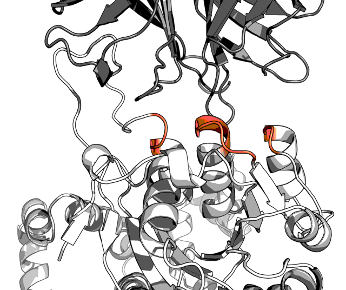

# crysalin

The aim is to engineer a better crysalin lattice.


## Background

Crysalins are an engineered complex that forms a lattice for encapsulating protein for X-ray crystallography.
The complex consists of AHIR and streptavidin.
AHIR consists of N-terminal Rossmann fold knob with strep-tag and a C-terminal helical bundle that knots with others,
forming a dodecamer, resulting in a cubic lattice with each steptavidin tetramers forming the vertices,
leaving a void for cargo.

The Rossmann fold binds weakly to Streptavidin beyond the tag held via a floppy linker.
Fortuitously, the complex is stabilised by a sugar, but that is a crystallisation artefact.
Crystallography >3Å, while AHIR ~1.6Å, Streptavidin ~1.0Å.
Previous attempts were point-mutants, but need major remodelling.
Therefore, can new designs be made that bind more strongly and are more rigid?

()

## People involved
Project members (Newcastle): Martin Noble, Mathew Martin, Rhianna Rowland
Project members (Oxford): Frank von Delft, Michael Fairhead, me (Matteo Ferla)

## Aim

Run both RFdiffusion and Rosetta Remodel to generate designs.

## Methods

### Summary
Rosetta Remodel is useful for generating parametrically designed proteins.
However, very few designs were successful and were outcompeted by RFdiffusion designs which tweaked the Rossmann fold.

RFdiffusion-AA was tried, but due to its early release status the results were more problematic than RFdiffusion.

Many iterations were performed.
Whereas RFdiffusion is for de novo design of whole domains, 
tweaking the Rossmann fold (primarily resi 41-46,64-66,144-146) was far more successful.

## Steps

1. RFdiffusion
2. Superposition to template in full complex: filtering ref2015 score (initial) or by Euclidean distance
3. ProteinMPNN x5
4. Threading
5. Complex with other AHIR dimer's stalk domain
6. Relaxing only chain A
8. FastDesign on differing residues
9. Interface scoring & interactions with Streptavidin counted
9. Ranking

Initially, these three extra steps were planned:

1. AlphaFold2 validation
2. Thermal tempering validation
3. Backrub drift

But various test failed their validity.

## Naming scheme

* Experiments were given Greek letters
* Replicates of RFdiffusion were given numbers
* Replicates of ProteinMPNN were given letters, with the letter Ø for the original polyglycine (control)

However, as the experiments had minor variations, suffices to the greek letters were used,
making the end result a bit of a mess and like this `eta_comboplus_104F.pdb`.

## RFdiffusion

RFdiffusion has a lot of settings. [rfdiffusion](code/job_RFdiffusion.sh) was run in the cluster
with the variable `APPTAINERENV_EXPERIMENT` controlling the experiment,
see script for each one.


There were several iterations.
The complex is huge. Therefore subsets were needed.
The final template used in diffusion was the pentakaihemimer (5 and a half chains: (1.5x AHIR, 4x Streptavidin).


This is because collisions were happening, for example here are the first 5 models from experiment Alpha,
which was a dimer...


Another example, from theta-hot experiment, which uses the trikaihemimer (1.5x AHIR, 2x Streptavidin):


RFdiffusion can accept residues that are more special for interactions ('hotspots' in their parlance).
Here are the hotspots from experiment Gamma:


| Experiment     | Replicates | Description               | Template                                        | Noise | Hotspots                                                                                                                                                                                     | Contig                                 | Verdict                                                                   |
|----------------|------------|---------------------------|-------------------------------------------------|-------|----------------------------------------------------------------------------------------------------------------------------------------------------------------------------------------------|----------------------------------------|---------------------------------------------------------------------------|
| Alpha          | 10         | test                      | dimer.pdb template A:AHIR, B:Streptavidin       | 0.    | [A222,A223,A224,A227,A228,B35,B37,B55,B59,B60,B62,B63,B64,B78,B80,B81,B82,B83,B85,B87]                                                                                                       | [1-150/A202-371/0 B13-135]             | interface is not dimeric, but trimeric AHIR·Strepx2                       |
| Beta           | 10         | test                      | trimer-renumbered.pdb A:AHIR, B+C:Streptavidin  | 0.5   | [B43,B68,B69,B70,B71,B73,B75,C23,C25,C47,C48,C50,C51,C52,C66,C53,C54,C55]                                                                                                                    | [1-150/A198-367/0 B1-123/0 C1-123/0]   | too many short constructs                                                 |
| Gamma_lownoise | 100        | low noise                 | trimer-renumbered.pdb A:AHIR, B+C:Streptavidin  | 0.5   | [A197,A198,A199,A202,A203,B43,B68,B69,B70,B71,B73,B75,C23,C25,C47,C48,C50,C51,C52,C66,C53,C54,C55]                                                                                           | [1-200/A196-367/0 B1-123/0 C1-123/0]   | .                                                                         |
| Gamma_midnoise | 100        | mid noise                 | trimer-renumbered.pdb A:AHIR, B+C:Streptavidin  | 0.5   | [A197,A198,A199,A202,A203,B43,B68,B69,B70,B71,B73,B75,C23,C25,C47,C48,C50,C51,C52,C66,C53,C54,C55]                                                                                           | [1-200/A196-367/0 B1-123/0 C1-123/0]   | .                                                                         |
| Gamma_midnoise | 100        | full noise                | trimer-renumbered.pdb A:AHIR, B+C:Streptavidin  | 0.5   | [A197,A198,A199,A202,A203,B43,B68,B69,B70,B71,B73,B75,C23,C25,C47,C48,C50,C51,C52,C66,C53,C54,C55]                                                                                           | [1-200/A196-367/0 B1-123/0 C1-123/0]   | .                                                                         |
| Gamma_mega     | 100        | up to 500 AA              | trimer-renumbered.pdb A:AHIR, B+C:Streptavidin  | 0.5   | [A197,A198,A199,A202,A203,B43,B68,B69,B70,B71,B73,B75,C23,C25,C47,C48,C50,C51,C52,C66,C53,C54,C55]                                                                                           | [1-500/A196-367/0 B1-123/0 C1-123/0]   | .                                                                         |
| Gamma_mini     | 100        | up to 100 AA              | trimer-renumbered.pdb A:AHIR, B+C:Streptavidin  | 0.5   | [A197,A198,A199,A202,A203,B43,B68,B69,B70,B71,B73,B75,C23,C25,C47,C48,C50,C51,C52,C66,C53,C54,C55]                                                                                           | [1-100/A196-367/0 B1-123/0 C1-123/0]   | .                                                                         |
| Gamma_Aless    | 100        | No dimeration CTD of AHIR | trimer-renumbered.pdb A:AHIR, B+C:Streptavidin  | 0.5   | [B43,B68,B69,B70,B71,B73,B75,C23,C25,C47,C48,C50,C51,C52,C66,C53,C54,C55]                                                                                                                    | [1-200/0 B1-123/0 C1-123/0]            | I should have kept the last residue of A. But most cases would be clashes |
| Delta_full     | 10         | .                         | trimer-renumbered.pdb A:AHIR, B+C:Streptavidin  | 0.5   | [A197,A198,A199,A202,A203,C1,C2,C3,C23,C25,C47,C48,C50,C51,C52,C53,C54,C55,C66,C84,C86,B13,B15,B31,B33,B34,B35,B37,B40,B42,B43,B67,B68,B69,B70,B71,B72,B73,B74,B75,B76,B78,B80,B96,B98,B100] | [150-400/A196-367/0 B3-121/0 C3-121/0] | .                                                                         |
| ...          | ...        | ...                       | ...                                             | ...   | ...                                                                                                                                                                                          | ...                                    | ...                                                                       | 

Were it done on a single GPU node, the code would be something like:
(This overwrites the protein MPNN jsonl files, but will only generate sequences if not present,
and will only thread and tune if not present. So previous runs should not interfere)

```bash
export WORKPATH=$HOME2/crysalin/output

# these are in my bashrc or conda env vars
export LD_LIBRARY_PATH=$CONDA_PREFIX/lib:/usr/local/cuda/compat:$LD_LIBRARY_PATH
export SLACK_WEBHOOK='https://hooks.slack.com/services/👾👾👾👾👾👾'
export RFDIFFUSSION_CONFIG=$HOME2/.cache/RFdiffusion_config/inference
export PROTEINMPNN_WEIGHTS=$HOME2/.cache/ProteinMPNN_weights/vanilla_model_weights


CUDA_VISIBLE_DEVICES=0 run_inference.py \
--config-path=$RFDIFFUSSION_CONFIG \
hydra.output_subdir=$HOME2/crysalin/output inference.output_prefix=$HOME2/crysalin/output/sigma/sigma \
 inference.input_pdb=$HOME2/crysalin/pentakaihemimer.relax.pdb \
 'ppi.hotspot_res=[A203,A204,A207,a271,a205,B25,B27,B43,B45,B46,B47,B49,B52,B54,B55,B79,B30,B81,B82,B83,B84,B85,B86,B87,B88,B90,B92,B108,B110,B112,C13,C14,C15,C35,C37,C59,C60,C62,C63,C64,C65,C66,C67,C78,C96,C98,L24,L25]'\
 'contigmap.contigs=[A5-9/10-20/A24-40/6-20/A47-51/20-40/A69-139/7-9/A149-158/8-12/A167-331/0 B13-135/0 C13-135/0 K13-135/0 L13-135/0 F304-332/0 a202-331/0]' \
 inference.num_designs=1000

python $HOME2/crysalin/superpose.py
python $HOME2/crysalin/prep_MPNN.py

CUDA_VISIBLE_DEVICES=0  python $CONDA_PREFIX/bin/protein_mpnn_run.py \
--jsonl_path $WORKPATH'/chains_definitions.jsonl' \
--chain_id_jsonl $WORKPATH'/fixed_chains.json' \
--fixed_positions_jsonl $WORKPATH'/fixed_positions.json' \
--out_folder $WORKPATH \
--num_seq_per_target 5 \
--sampling_temp "0.1" \
--seed 37 \
--batch_size 1 \
--path_to_model_weights $PROTEINMPNN_WEIGHTS;

python $HOME2/crysalin/thread_tune.py

curl -X POST -H 'Content-type: application/json' --data '{"text":"experiment sigma done"}' $SLACK_WEBHOOK
```


## Rosetta Remodel

In Parallel Rosetta Remodel was used in PyRosetta in [remodel.py](code/initial/remodel.py).
For the sake of sanity, the constructs were renumbered PDB -> Pose numbering
as Remodel is odd when multichain PDBs and PDB numbering are used.

The blueprints are in misc, but were generated dynamically in the script
(cf [tutorial](https://blog.matteoferla.com/2021/04/remodel-in-pyrosetta.html) for working).

Three sub-experiments were run:

* ins36_41 — 6 any SS residues with redesigned flanks (with helical preference)
* ins59_61 — 6 helical residue insertion and 3 any SS residues with redesigned flanks
* ins139_141 — 4 residue insertion with redesigned flanks



The vast majority of Remodel experiments were not successful and gave a polyglycine
(the set default residue for kinematic closure).

## Filtering

> Script: [code/superpose.py](superpose.py)

Even if the models are polyglycine, they can be used to tell if there are clashes.
Here is a prelimary plot of progress of the generated models:


In the filtering removing models non-forming interactions was important.


Initially this was done in PyRosetta ignoring Lennard-Jones attraction term and
only looking at clashes (high Lennard-Jones repulsion term).
Subsequently, distance matrix was used to filter out models that were too far from the streptavidin or too close to
other parts.

## Other

see [former_notes.md](former_notes.md) for more details.

## Footnote: helical

RFdiffusion is said to be good at helices and sheet, but poor at loops.
Here is a helical interaction for example:


## Footnote: Open-closed loop choice


PDB:1SWE vs PDB:1SWB

> :construction: :warning: TODO ...

## Footnote: I remember seeing that

I have not run AF2 validation en masse, however I am concerned by some tests:
AF2 makes models which better match the template than Rosetta energy minimised.
That is to say, AF2 is remembering seeing the fold, which I don't like,
hence the threading+relaxing step
and leaving AF2 as a 'redocking test'.


## Footnote: Caveat

Many of the scripts were run in a reverse–port-forwarded Jupyter Lab notebook running in the cluster
([tutorial](https://www.blopig.com/blog/2023/10/ssh-the-boss-fight-level-jupyter-notebooks-from-compute-nodes/)).
And for archiving they are presented here as scripts with variables hardcoded in the top...
A few step generate a godzillion files in a single directory, which is bad for the FS.

## Footnote: Streptavidin binders

Does Streptavin have natural binders?

Guilt by association, especially in thermophiles, is a good way to catch functional intertwined protein.
I just checked Steptomyces avidinii but not its relatives and it's not in a operon.
Its neighbours are:

* WP_189973519.1: Aryl-sulfate sulfotransferase (AssT) is a dimer in _E. coli_. In operon w/ ABC transporter
* WP_189973633.1: Cytochrome P450. Suppressed entry, but homologous to other actinomycetian P450

* Thematically similar, but not a smoking gun


## Footnote: RFdiffusion installation

> [install.sh](code/install.sh) :construction: :warning: TODO FINISH COPYING

Installation of RFdiffusion is curious, but straightforward albeit manual ([install.sh](code/install.sh))
—it needs some cleaning up lest one is fine with stuff dumped around.
