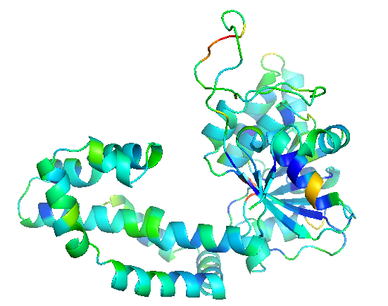

## Analysis

The top 20 of the first batch were very poorly soluble.

Is there a way to predict this?

## Solvatation

The first suspect is solvation.
Solubility is not solvation. The protein could be unstable but the model could have good solvation.

Rosetta uses the [Lazaridis-Karplus model for solvation](https://doi.org/10.1002/(SICI)1097-0134(19990501)35:2%3C133::AID-PROT1%3E3.0.CO;2-N).

```python
## General imports
import os
import operator
import string
import random
import numpy as np
from Bio import SeqIO
from pathlib import Path
import re, os, traceback
from pebble import ProcessPool, ProcessFuture
from concurrent.futures import TimeoutError
import time
import json
from typing import Optional, Dict, List
from types import ModuleType
import pandas as pd
import pyrosetta
import pyrosetta_help as ph
prc: ModuleType = pyrosetta.rosetta.core
prp: ModuleType = pyrosetta.rosetta.protocols
pru: ModuleType = pyrosetta.rosetta.utility  # noqa
prn: ModuleType = pyrosetta.rosetta.numeric
prs: ModuleType = pyrosetta.rosetta.std  # noqa
pr_conf: ModuleType = pyrosetta.rosetta.core.conformation
pr_scoring: ModuleType = pyrosetta.rosetta.core.scoring
pr_options: ModuleType = pyrosetta.rosetta.basic.options
```

Importing a few test cases:
```python
holo = pyrosetta.pose_from_file('pentakaihemimer.relax.pdb')
apo = holo.split_by_chain(1)
```

Or

```python
filename = next(Path('repo/designs').glob('001*.pdb')).as_posix()
print(filename)
holo = pyrosetta.pose_from_file(filename)
apo = holo.split_by_chain(1)
```
    

Or

```python
# barnase-barnstar heterotetramer
holo = pyrosetta.toolbox.pose_from_rcsb('2ZA4')
apo = holo.split_by_chain(1)
```
The difference in solvation energy per residue:

```python
import numpy as np
import numpy.typing as npt
from scipy.special import logsumexp
import plotly.express as px

scorefxn: pr_scoring.ScoreFunction = pyrosetta.get_fa_scorefxn()
# fill energies
holo.energies().clear_energies()
apo.energies().clear_energies()
print(scorefxn(holo), scorefxn(apo))
apo_energies: npt.NDArray[np.float64] = apo.energies().residue_total_energies_array()
holo_energies: npt.NDArray[np.float64] = holo.energies().residue_total_energies_array()
length = apo.total_residue()
px.histogram(apo_energies['fa_sol'], title='Apo').show()
delta = apo_energies['fa_sol'][:length] - holo_energies['fa_sol'][:length]
px.histogram(delta, title='Delta').show()
cacodelta = delta[delta > 0]
cacodelta.max(), logsumexp(cacodelta), delta.mean(), length
```

There does not seem to be much of a difference between a healthy protein  and an insoluble one.

Note to self. `energies.dtype` is 
```python
dtype([('fa_atr', '<f8'), 
       ('fa_rep', '<f8'), 
       ('fa_sol', '<f8'), 
       ('fa_intra_rep', '<f8'), 
       ('fa_intra_sol_xover4', '<f8'), 
       ('lk_ball_wtd', '<f8'), ('fa_elec', '<f8'), 
       ('pro_close', '<f8'), ('hbond_sr_bb', '<f8'), 
       ('hbond_lr_bb', '<f8'), ('hbond_bb_sc', '<f8'), 
       ('hbond_sc', '<f8'), 
       ('dslf_fa13', '<f8'), 
       ('omega', '<f8'), 
       ('fa_dun', '<f8'), 
       ('p_aa_pp', '<f8'), 
       ('yhh_planarity', '<f8'), 
       ('ref', '<f8'), 
       ('rama_prepro', '<f8'), 
       ('total_score', '<f8')])
```

Full dataset, using softmax.
    
```python
import numpy as np
import numpy.typing as npt
from scipy.special import logsumexp
import plotly.express as px
import pandas as pd


def get_apo_sol(holo):
    apo = holo.split_by_chain(1)
    # ## fill energies
    #holo.energies().clear_energies()
    #apo.energies().clear_energies()
    vanilla_scorefxn(holo), vanilla_scorefxn(apo)
    # ## get energies
    apo_energies: npt.NDArray[np.float64] = apo.energies().residue_total_energies_array()
    #holo_energies: npt.NDArray[np.float64] = holo.energies().residue_total_energies_array()
    length = apo.total_residue()
    return apo_energies['fa_sol'][:length]

posedex = {'ref': pyrosetta.pose_from_file('pentakaihemimer.relax.pdb')}
for path in Path('repo/designs').glob('*.pdb'):
    posedex[path.stem] = pyrosetta.pose_from_file(path.as_posix())
apo_dex = {name: get_apo_sol(pose) for name, pose in posedex.items()}

s = pd.Series({n: logsumexp(a) for n, a in apo_dex.items()})
px.bar(s)
```

There is no major difference. Solvation is not the smoking gun.

## Per residue

Total pose energy was terrible. I had assumed due to the dastardly streptag.

```python
s = pd.Series({name: scorefxn(pose) for name, pose in posedex.items()})
px.bar(s)
```

Is it?

```python


import numpy as np
import numpy.typing as npt
from scipy.special import logsumexp
import plotly.express as px

def get_apo_tot(holo):
    apo = holo.split_by_chain(1)
    # ## fill energies
    #holo.energies().clear_energies()
    #apo.energies().clear_energies()
    vanilla_scorefxn(holo), vanilla_scorefxn(apo)
    # ## get energies
    apo_energies: npt.NDArray[np.float64] = apo.energies().residue_total_energies_array()
    #holo_energies: npt.NDArray[np.float64] = holo.energies().residue_total_energies_array()
    length = apo.total_residue()
    return apo_energies['total_score'][:length]

apo_dex = {name: get_apo_tot(pose) for name, pose in posedex.items()}
s = pd.Series({n: logsumexp(a) for n, a in apo_dex.items()})
px.bar(s)
```

Store as B-factors for visualisation.

```python
def set_bfactor(pose, vector):
    pi: prc.pose.PDBInfo = pose.pdb_info()
    for r, v in enumerate(vector):
        for a in range(pose.residue(r+1).natoms()):
            pi.bfactor(res=r+1, atom_index=a+1, t=v)
    pose.pdb_info(pi)  # not needed I think


scorefxn: pr_scoring.ScoreFunction = pyrosetta.get_fa_scorefxn()
ref = posedex['ref']
ref = posedex['001-omicron_143F']
pose: pyrosetta.Pose  = ref.split_by_chain(1)
scorefxn(pose)
energies: npt.NDArray[np.float64] = pose.energies().residue_total_energies_array()
set_bfactor(pose, energies['total_score'])
pose.dump_pdb('test.pdb')
```



The question now is, why did I not check visually??

The next question is how do I work with the streptag?

