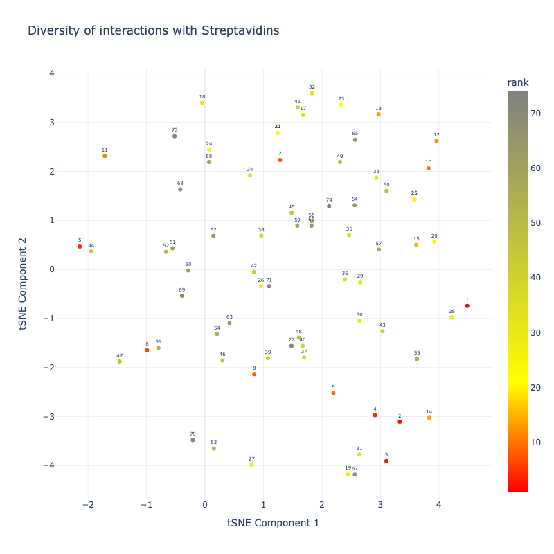
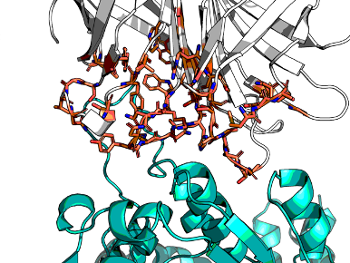
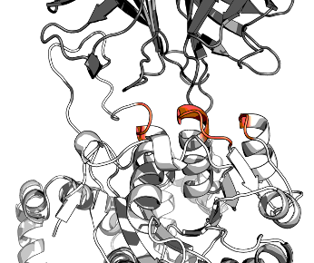
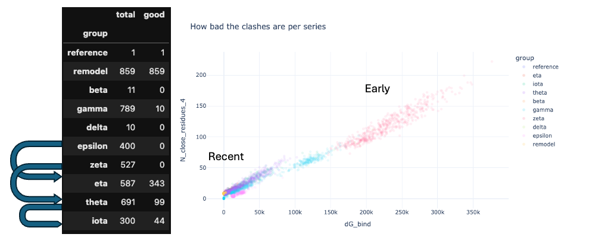
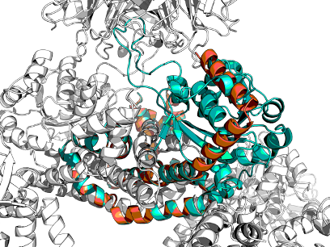
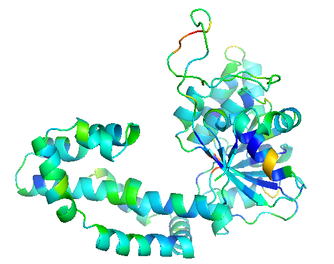

## Iteration 1

## Naming scheme

* Experiments were given Greek letters
* Replicates of RFdiffusion were given numbers
* Replicates of ProteinMPNN were given letters, with the letter Ø for the original polyglycine (control)

However, as the experiments had minor variations, suffices to the greek letters were used,
making the end result a bit of a mess and like this `eta_comboplus_104F.pdb`.

## RFdiffusion

RFdiffusion has a lot of settings. [rfdiffusion](code/slurm/job_RFdiffusion.sh) was run in the cluster
with the variable `APPTAINERENV_EXPERIMENT` controlling the experiment,
see script for each one.



There were several iterations.

RFdiffusion can accept residues that are more special for interactions ('hotspots' in their parlance).
Here are the hotspots from experiment Gamma:


| Experiment     | Replicates | Description               | Template                                        | Noise | Hotspots                                                                                                                                                                                     | Contig                                 | Verdict                                                                   |
|----------------|------------|---------------------------|-------------------------------------------------|-------|----------------------------------------------------------------------------------------------------------------------------------------------------------------------------------------------|----------------------------------------|---------------------------------------------------------------------------|
| Alpha          | 10         | test                      | dimer.pdb template A:AHIR, B:Streptavidin       | 0.    | [A222,A223,A224,A227,A228,B35,B37,B55,B59,B60,B62,B63,B64,B78,B80,B81,B82,B83,B85,B87]                                                                                                       | [1-150/A202-371/0 B13-135]             | interface is not dimeric, but trimeric AHIR·Strepx2                       |
| Beta           | 10         | test                      | trimer-renumbered.pdb A:AHIR, B+C:Streptavidin  | 0.5   | [B43,B68,B69,B70,B71,B73,B75,C23,C25,C47,C48,C50,C51,C52,C66,C53,C54,C55]                                                                                                                    | [1-150/A198-367/0 B1-123/0 C1-123/0]   | too many short constructs                                                 |
| Gamma_lownoise | 100        | low noise                 | trimer-renumbered.pdb A:AHIR, B+C:Streptavidin  | 0.5   | [A197,A198,A199,A202,A203,B43,B68,B69,B70,B71,B73,B75,C23,C25,C47,C48,C50,C51,C52,C66,C53,C54,C55]                                                                                           | [1-200/A196-367/0 B1-123/0 C1-123/0]   | .                                                                         |
| Gamma_midnoise | 100        | mid noise                 | trimer-renumbered.pdb A:AHIR, B+C:Streptavidin  | 0.5   | [A197,A198,A199,A202,A203,B43,B68,B69,B70,B71,B73,B75,C23,C25,C47,C48,C50,C51,C52,C66,C53,C54,C55]                                                                                           | [1-200/A196-367/0 B1-123/0 C1-123/0]   | .                                                                         |
| Gamma_midnoise | 100        | full noise                | trimer-renumbered.pdb A:AHIR, B+C:Streptavidin  | 0.5   | [A197,A198,A199,A202,A203,B43,B68,B69,B70,B71,B73,B75,C23,C25,C47,C48,C50,C51,C52,C66,C53,C54,C55]                                                                                           | [1-200/A196-367/0 B1-123/0 C1-123/0]   | .                                                                         |
| Gamma_mega     | 100        | up to 500 AA              | trimer-renumbered.pdb A:AHIR, B+C:Streptavidin  | 0.5   | [A197,A198,A199,A202,A203,B43,B68,B69,B70,B71,B73,B75,C23,C25,C47,C48,C50,C51,C52,C66,C53,C54,C55]                                                                                           | [1-500/A196-367/0 B1-123/0 C1-123/0]   | .                                                                         |
| Gamma_mini     | 100        | up to 100 AA              | trimer-renumbered.pdb A:AHIR, B+C:Streptavidin  | 0.5   | [A197,A198,A199,A202,A203,B43,B68,B69,B70,B71,B73,B75,C23,C25,C47,C48,C50,C51,C52,C66,C53,C54,C55]                                                                                           | [1-100/A196-367/0 B1-123/0 C1-123/0]   | .                                                                         |
| Gamma_Aless    | 100        | No dimeration CTD of AHIR | trimer-renumbered.pdb A:AHIR, B+C:Streptavidin  | 0.5   | [B43,B68,B69,B70,B71,B73,B75,C23,C25,C47,C48,C50,C51,C52,C66,C53,C54,C55]                                                                                                                    | [1-200/0 B1-123/0 C1-123/0]            | I should have kept the last residue of A. But most cases would be clashes |
| Delta_full     | 10         | .                         | trimer-renumbered.pdb A:AHIR, B+C:Streptavidin  | 0.5   | [A197,A198,A199,A202,A203,C1,C2,C3,C23,C25,C47,C48,C50,C51,C52,C53,C54,C55,C66,C84,C86,B13,B15,B31,B33,B34,B35,B37,B40,B42,B43,B67,B68,B69,B70,B71,B72,B73,B74,B75,B76,B78,B80,B96,B98,B100] | [150-400/A196-367/0 B3-121/0 C3-121/0] | .                                                                         |
| ...          | ...        | ...                       | ...                                             | ...   | ...                                                                                                                                                                                          | ...                                    | ...                                                                       | 

Were it done on a single GPU node, the code would be something like:
(This overwrites the protein MPNN jsonl files, but will only generate sequences if not present,
and will only thread and tune if not present. So previous runs should not interfere)

```bash
export WORKPATH=$HOME2/crysalin/output

# these are in my bashrc or conda env vars
export LD_LIBRARY_PATH=$CONDA_PREFIX/lib:/usr/local/cuda/compat:$LD_LIBRARY_PATH
export SLACK_WEBHOOK='https://hooks.slack.com/services/👾👾👾👾👾👾'
export RFDIFFUSSION_CONFIG=$HOME2/.cache/RFdiffusion_config/inference
export PROTEINMPNN_WEIGHTS=$HOME2/.cache/ProteinMPNN_weights/vanilla_model_weights


CUDA_VISIBLE_DEVICES=0 run_inference.py \
--config-path=$RFDIFFUSSION_CONFIG \
hydra.output_subdir=$HOME2/crysalin/output inference.output_prefix=$HOME2/crysalin/output/sigma/sigma \
 inference.input_pdb=$HOME2/crysalin/pentakaihemimer.relax.pdb \
 'ppi.hotspot_res=[A203,A204,A207,a271,a205,B25,B27,B43,B45,B46,B47,B49,B52,B54,B55,B79,B30,B81,B82,B83,B84,B85,B86,B87,B88,B90,B92,B108,B110,B112,C13,C14,C15,C35,C37,C59,C60,C62,C63,C64,C65,C66,C67,C78,C96,C98,L24,L25]'\
 'contigmap.contigs=[A5-9/10-20/A24-40/6-20/A47-51/20-40/A69-139/7-9/A149-158/8-12/A167-331/0 B13-135/0 C13-135/0 K13-135/0 L13-135/0 F304-332/0 a202-331/0]' \
 inference.num_designs=1000

python $HOME2/crysalin/superpose.py
python $HOME2/crysalin/prep_MPNN_v1.py

CUDA_VISIBLE_DEVICES=0  python $CONDA_PREFIX/bin/protein_mpnn_run.py \
--jsonl_path $WORKPATH'/chains_definitions.jsonl' \
--chain_id_jsonl $WORKPATH'/fixed_chains.json' \
--fixed_positions_jsonl $WORKPATH'/fixed_positions.json' \
--out_folder $WORKPATH \
--num_seq_per_target 5 \
--sampling_temp "0.1" \
--seed 37 \
--batch_size 1 \
--path_to_model_weights $PROTEINMPNN_WEIGHTS;

python $HOME2/crysalin/thread_tune_v1.py

curl -X POST -H 'Content-type: application/json' --data '{"text":"experiment sigma done"}' $SLACK_WEBHOOK
```

## Rosetta Remodel

In Parallel Rosetta Remodel was used in PyRosetta in [remodel.py](code/initial/remodel.py).
For the sake of sanity, the constructs were renumbered PDB -> Pose numbering
as Remodel is odd when multichain PDBs and PDB numbering are used.

The blueprints are in misc, but were generated dynamically in the script
(cf [tutorial](https://blog.matteoferla.com/2021/04/remodel-in-pyrosetta.html) for working).

Three sub-experiments were run:

* ins36_41 — 6 any SS residues with redesigned flanks (with helical preference)
* ins59_61 — 6 helical residue insertion and 3 any SS residues with redesigned flanks
* ins139_141 — 4 residue insertion with redesigned flanks



The vast majority of Remodel experiments were not successful and gave a polyglycine
(the set default residue for kinematic closure).

## Filtering

> Script: [code/superpose.py](superpose.py)

Even if the models are polyglycine, they can be used to tell if there are clashes.
Here is a prelimary plot of progress of the generated models:


In the filtering removing models non-forming interactions was important.



Initially this was done in PyRosetta ignoring Lennard-Jones attraction term and
only looking at clashes (high Lennard-Jones repulsion term).
Subsequently, distance matrix was used to filter out models that were too far from the streptavidin or too close to
other parts.


## Post mortem analysis

The top 20 of the first batch were very poorly soluble.

Is there a way to predict this?

## Solvatation

The first suspect is solvation.
Solubility is not solvation. The protein could be unstable but the model could have good solvation.

Rosetta uses the [Lazaridis-Karplus model for solvation](https://doi.org/10.1002/(SICI)1097-0134(19990501)35:2%3C133::AID-PROT1%3E3.0.CO;2-N).

```python
## General imports
import os
import operator
import string
import random
import numpy as np
from Bio import SeqIO
from pathlib import Path
import re, os, traceback
from pebble import ProcessPool, ProcessFuture
from concurrent.futures import TimeoutError
import time
import json
from typing import Optional, Dict, List
from types import ModuleType
import pandas as pd
import pyrosetta
import pyrosetta_help as ph
prc: ModuleType = pyrosetta.rosetta.core
prp: ModuleType = pyrosetta.rosetta.protocols
pru: ModuleType = pyrosetta.rosetta.utility  # noqa
prn: ModuleType = pyrosetta.rosetta.numeric
prs: ModuleType = pyrosetta.rosetta.std  # noqa
pr_conf: ModuleType = pyrosetta.rosetta.core.conformation
pr_scoring: ModuleType = pyrosetta.rosetta.core.scoring
pr_options: ModuleType = pyrosetta.rosetta.basic.options
```

Importing a few test cases:
```python
holo = pyrosetta.pose_from_file('pentakaihemimer.relax.pdb')
apo = holo.split_by_chain(1)
```

Or

```python
filename = next(Path('repo/designs').glob('001*.pdb')).as_posix()
print(filename)
holo = pyrosetta.pose_from_file(filename)
apo = holo.split_by_chain(1)
```
    

Or

```python
# barnase-barnstar heterotetramer
holo = pyrosetta.toolbox.pose_from_rcsb('2ZA4')
apo = holo.split_by_chain(1)
```
The difference in solvation energy per residue:

```python
import numpy as np
import numpy.typing as npt
from scipy.special import logsumexp
import plotly.express as px

scorefxn: pr_scoring.ScoreFunction = pyrosetta.get_fa_scorefxn()
# fill energies
holo.energies().clear_energies()
apo.energies().clear_energies()
print(scorefxn(holo), scorefxn(apo))
apo_energies: npt.NDArray[np.float64] = apo.energies().residue_total_energies_array()
holo_energies: npt.NDArray[np.float64] = holo.energies().residue_total_energies_array()
length = apo.total_residue()
px.histogram(apo_energies['fa_sol'], title='Apo').show()
delta = apo_energies['fa_sol'][:length] - holo_energies['fa_sol'][:length]
px.histogram(delta, title='Delta').show()
cacodelta = delta[delta > 0]
cacodelta.max(), logsumexp(cacodelta), delta.mean(), length
```

There does not seem to be much of a difference between a healthy protein  and an insoluble one.

Note to self. `energies.dtype` is 
```python
dtype([('fa_atr', '<f8'), 
       ('fa_rep', '<f8'), 
       ('fa_sol', '<f8'), 
       ('fa_intra_rep', '<f8'), 
       ('fa_intra_sol_xover4', '<f8'), 
       ('lk_ball_wtd', '<f8'), ('fa_elec', '<f8'), 
       ('pro_close', '<f8'), ('hbond_sr_bb', '<f8'), 
       ('hbond_lr_bb', '<f8'), ('hbond_bb_sc', '<f8'), 
       ('hbond_sc', '<f8'), 
       ('dslf_fa13', '<f8'), 
       ('omega', '<f8'), 
       ('fa_dun', '<f8'), 
       ('p_aa_pp', '<f8'), 
       ('yhh_planarity', '<f8'), 
       ('ref', '<f8'), 
       ('rama_prepro', '<f8'), 
       ('total_score', '<f8')])
```

Full dataset, using softmax.
    
```python
import numpy as np
import numpy.typing as npt
from scipy.special import logsumexp
import plotly.express as px
import pandas as pd


def get_apo_sol(holo):
    apo = holo.split_by_chain(1)
    # ## fill energies
    #holo.energies().clear_energies()
    #apo.energies().clear_energies()
    vanilla_scorefxn(holo), vanilla_scorefxn(apo)
    # ## get energies
    apo_energies: npt.NDArray[np.float64] = apo.energies().residue_total_energies_array()
    #holo_energies: npt.NDArray[np.float64] = holo.energies().residue_total_energies_array()
    length = apo.total_residue()
    return apo_energies['fa_sol'][:length]

posedex = {'ref': pyrosetta.pose_from_file('pentakaihemimer.relax.pdb')}
for path in Path('repo/designs').glob('*.pdb'):
    posedex[path.stem] = pyrosetta.pose_from_file(path.as_posix())
apo_dex = {name: get_apo_sol(pose) for name, pose in posedex.items()}

s = pd.Series({n: logsumexp(a) for n, a in apo_dex.items()})
px.bar(s)
```

There is no major difference. Solvation is not the smoking gun.

## Per residue

Total pose energy was terrible. I had assumed due to the dastardly streptag.

```python
s = pd.Series({name: scorefxn(pose) for name, pose in posedex.items()})
px.bar(s)
```

Is it?

```python


import numpy as np
import numpy.typing as npt
from scipy.special import logsumexp
import plotly.express as px

def get_apo_tot(holo):
    apo = holo.split_by_chain(1)
    # ## fill energies
    #holo.energies().clear_energies()
    #apo.energies().clear_energies()
    vanilla_scorefxn(holo), vanilla_scorefxn(apo)
    # ## get energies
    apo_energies: npt.NDArray[np.float64] = apo.energies().residue_total_energies_array()
    #holo_energies: npt.NDArray[np.float64] = holo.energies().residue_total_energies_array()
    length = apo.total_residue()
    return apo_energies['total_score'][:length]

apo_dex = {name: get_apo_tot(pose) for name, pose in posedex.items()}
s = pd.Series({n: logsumexp(a) for n, a in apo_dex.items()})
px.bar(s)
```

Store as B-factors for visualisation.

```python
def set_bfactor(pose, vector):
    pi: prc.pose.PDBInfo = pose.pdb_info()
    for r, v in enumerate(vector):
        for a in range(pose.residue(r+1).natoms()):
            pi.bfactor(res=r+1, atom_index=a+1, t=v)
    pose.pdb_info(pi)  # not needed I think


scorefxn: pr_scoring.ScoreFunction = pyrosetta.get_fa_scorefxn()
ref = posedex['ref']
ref = posedex['001-omicron_143F']
pose: pyrosetta.Pose  = ref.split_by_chain(1)
scorefxn(pose)
energies: npt.NDArray[np.float64] = pose.energies().residue_total_energies_array()
set_bfactor(pose, energies['total_score'])
pose.dump_pdb('test.pdb')
```



The question now is, why did I not check visually??

The next question is how do I work with the streptag?

