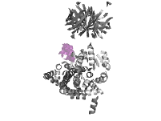

# Iteration 2

This was a smaller number of redesigned residues, targeted to certain regions and not all at once.
Six design groups were made.

Additionally, five major changes were done in the code:

* Sidechain copying was rewritten to be more robust
* the TRB file was used to control was designed —I had not noticed this file before
* hydrophobic SASA was given a larger role in analysis
* The tuning was refactored
* The design definitions were by a YAML file

## Design definitions

The design definitions were moved to a YAML file [experiments_v2.yaml](experiments_v2.yaml).
The template is `pentakaihemimer_renumbered.pdb`.
Hotspots were redefined to be more specific.

Mid helix:

Side helix:
#Helix that sticks up
    codename: side
    change: 64-66
    contig: '[A5-63/6-20/A67-331/0 B1-651/0]'
    hotspots: '[B124,B125,B126,B127,B171,B173,B174,B175,B176,B177,B178,B178,B182,B207,B209]'

Post-tag:

Pocket-fill:
# 

### Bed

This is a loop that sits on the Rossmann fold.

Initial definitions:

    codename: bed
    change: 10-23
    contig: '[A5-9/14-32/A24-331/0 B1-651/0]'
    hotspots: '[B37,B39,B41,B43,B70,B71]'

Later definitions:

    codename: bedbig
    change: 10-23
    contig: '[A5-9/28-48/A24-331/0 B1-651/0]'
    hotspots: '[B37,B39,B41,B43,B70,B71]'

### Side helix

### Mid helix

Helix that sticks up

    codename: mid
    change: 41-43
    contig: '[A5-40/3-20/A44-331/0 B1-651/0]'
    hotspots: '[B43,B68,B70,B75,B147,B170,B173,B174]'

### Post-tag

The Streptag is WSHPQFEK, W150-S151-H152-P153-Q154-F155-E156-K157

    codename: posttag
    change: 161-167
    contig: '[A5-160/2-20/A167-331/0 B1-651/0]'
    hotspots: '[A135,A139,A148,A149,A151,A158,A194,A258,B37,B39,B507,B564,B568]'

### Pocket

Pocket is still Thermus thermophilus AHIR: fill/rigidify the catalytic pocket

    codename: pocketfill
    change: 26-31 52-56 82-85 110-113 135-138  
    contig: '[A5-25/5-10/A32-51/5-10/A57-81/4-10/A86-109/4-10/A114-134/4-10/A139-331/0 B1-651/0]'
    hotspots: '[A205,A325,B568,B572,B576,B579,B587,B588]'

### Inner

Helix that sticks up. But keep Y144!

    codename: inner
    change: 145-146
    contig: '[A5-144/2-20/A147-331/0 B1-651/0]'

## Job submission

TODO FINISH WRITING!

## Results

TODO FINISH WRITING!

Bed loop:

Inner loop:

Mid helix:

Side helix:

Post-tag:

Pocket fill:

Discussion point. The selection tends to favour smaller designs.
The following are the larger designs:

