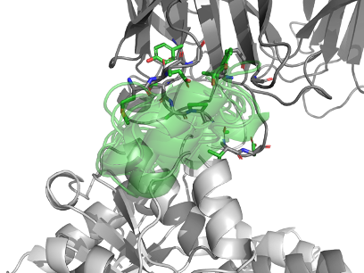

# Iteration 2

This was a smaller number of redesigned residues, targeted to certain regions and not all at once.
Six design groups were made.


Additionally, five major changes were done in the code:

* Sidechain copying was rewritten to be more robust
* the TRB file was used to control was designed —I had not noticed this file before
* hydrophobic SASA was given a larger role in analysis
* The tuning was refactored
* The design definitions were by a YAML file

## Design definitions

The design definitions were moved to a YAML file [experiments_v2.yaml](experiments_v2.yaml).
The template is `pentakaihemimer_renumbered.pdb`.
Hotspots were redefined to be more specific.

### Bed

This is a loop that sits on the Rossmann fold.

Initial definitions:

    codename: bed
    change: 10-23
    contig: '[A5-9/14-32/A24-331/0 B1-651/0]'
    hotspots: '[B37,B39,B41,B43,B70,B71]'

Later definitions:

    codename: bedbig
    change: 10-23
    contig: '[A5-9/28-48/A24-331/0 B1-651/0]'
    hotspots: '[B37,B39,B41,B43,B70,B71]'


### Side helix

A helix on the side that sticks up

    codename: side
    change: 64-66
    contig: '[A5-63/6-20/A67-331/0 B1-651/0]'
    hotspots: '[B124,B125,B126,B127,B171,B173,B174,B175,B176,B177,B178,B178,B182,B207,B209]'




### Mid helix

Helix that sticks up

    codename: mid
    change: 41-43
    contig: '[A5-40/3-20/A44-331/0 B1-651/0]'
    hotspots: '[B43,B68,B70,B75,B147,B170,B173,B174]'


### Post-tag

The Streptag is WSHPQFEK, W150-S151-H152-P153-Q154-F155-E156-K157

    codename: posttag
    change: 161-167
    contig: '[A5-160/2-20/A167-331/0 B1-651/0]'
    hotspots: '[A135,A139,A148,A149,A151,A158,A194,A258,B37,B39,B507,B564,B568]'


### Pocket

Pocket is still Thermus thermophilus AHIR: fill/rigidify the catalytic pocket

    codename: pocketfill
    change: 26-31 52-56 82-85 110-113 135-138  
    contig: '[A5-25/5-10/A32-51/5-10/A57-81/4-10/A86-109/4-10/A114-134/4-10/A139-331/0 B1-651/0]'
    hotspots: '[A205,A325,B568,B572,B576,B579,B587,B588]'


### Inner

Helix that sticks up. But keep Y144!

    codename: inner
    change: 145-146
    contig: '[A5-144/2-20/A147-331/0 B1-651/0]'


## Job submission
[pipeline.ipynb](code/iteration_2_slurm/pipeline.ipynb)

Say the experiment is bed4B (the notebook will generate the following commands):
```bash
export NUMDESIGNS=1000;
export EXPERIMENT=bed4B;
export HOTSPOTS='[B37,B39,B41,B43,B70,B71]';
export CONTIGMAP='[A5-9/14-32/A24-331/0 B1-651/0]';
sbatch rf.slurm.sh;

export WORKPATH_ROOT=👾👾/output
export WORKPATH=$WORKPATH_ROOT/bed4B;
sbatch proteinMPNN.slurm.sh;

export EXPERIMENT=bed4B;
sbatch tune.slurm.sh;

export EXPERIMENT=bed4B;
sbatch rescore.slurm.sh;
```

## Results

**TODO FINISH WRITING**

### Bed loop


* Files: [bed](designs_v2/bed)
* PyMOL session: [bed.pse](designs_v2/bed/bed.pse)
* Sequences: [bed.fa](designs_v2/bed/bed.fa) 

### Inner loop


* Files: [inner](designs_v2/inner)
* PyMOL session: [inner.pse](designs_v2/inner/inner.pse)
* Sequences: [inner.fa](designs_v2/inner/inner.fa)

### Mid helix


* Files: [mid](designs_v2/mid)
* PyMOL session: [mid.pse](designs_v2/mid/mid.pse)
* Sequences: [mid.fa](designs_v2/mid/mid.fa)

### Side helix


* Files: [side](designs_v2/side)
* PyMOL session: [side.pse](designs_v2/side/side.pse)
* Sequences: [side.fa](designs_v2/side/side.fa)

### Post-tag


* Files: [posttag](designs_v2/posttag)
* PyMOL session: [posttag.pse](designs_v2/posttag/posttag.pse)
* Sequences: [posttag.fa](designs_v2/posttag/posttag.fa)

### Pocket fill


* Files: [pocketfill](designs_v2/pocket)
* PyMOL session: [pocketfill.pse](designs_v2/pocket/pocket.pse)
* Sequences: [pocketfill.fa](designs_v2/pocket/pocket.fa)

### Heavies
Discussion point. The selection tends to favour smaller designs.
The following are the larger designs:


* Files: [heavies](designs_v2/heavies)
* PyMOL session: [heavies.pse](designs_v2/heavies/heavies.pse)
* Sequences: [heavies.fa](designs_v2/heavies/heavies.fa)


